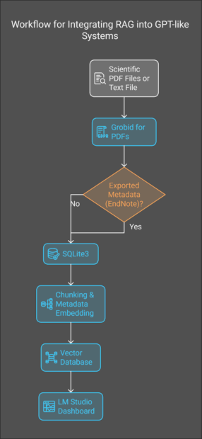

<details>
<summary><strong>Chat_Dashboard_OpenAI_Gemini_KIMI.ipynb: Multi-LLM Chat Dashboard</strong></summary>

A simple, user-friendly chat interface built with Gradio, supporting conversational access to multiple LLM providers:
- **OpenAI (GPT-4, GPT-4o, DALL·E 3)**
- **Kimi (Moonshot AI)**
- **Google Gemini**

**Features:**
- Select your preferred model from a dropdown menu.
- Switch between OpenAI, Gemini, and Kimi using their API keys.
- No setup complexity: just provide your API keys for each provider in a `config.json` file (see notebook for example).
- Proxy support for network flexibility.
- Chat history retention and retry/undo features.
- Supports basic image generation via DALL·E 3 and built-in functions (where available) for Kimi.

> For details on configuring API keys and using the dashboard, see the instructions in the notebook.


</details>

---

# RAG with LM Studio

---

<details>
<summary><strong>StandAlone_Load_Vecdb_RAG_CHAT_v4.ipynb: All-in-One RAG Dashboard (Recommended)</strong></summary>

This notebook is the <strong>recommended entry point</strong> for most users. It brings together all steps needed for document-based Retrieval-Augmented Generation (RAG) in a single, easy-to-use Gradio dashboard.

<strong>Key Features:</strong>
- <strong>End-to-end pipeline</strong>: From PDF upload, extraction (via GROBID), chunking, embedding, vectorization, and retrieval—all in one place.
- <strong>Integrated chat interface</strong>: Ask questions about your documents using local LLMs (LM Studio - Server).
- <strong>Multiple retrieval strategies</strong>: Choose between standard and advanced retrieval methods (e.g., LangChain MultiQueryRetriever).
- <strong>Dashboard UI</strong>: User-friendly controls for every step, minimal setup.

<strong>🚩 Important Requirements:</strong>
- <strong>LM Studio must be running</strong> for local LLM chat and embedding tasks.
- <strong>GROBID Docker container must be running</strong> for PDF text extraction.  
  (Start GROBID via Docker before launching the notebook.)

> This notebook is ideal if you want a one-stop solution without running multiple scripts or notebooks.

See the notebook for detailed inline instructions and troubleshooting tips.

</details>

---


## Other Notebooks used cell by cell for RAG based on a set of PDFs: `PDF_RAG_with_LMstudio_opti.ipynb`




This notebook performs the following operations:
- **Reads all PDFs** in a given folder
- **Extracts text** using GROBID
- **Stores text elements** in SQLite3 database
- **Handles recursive chunks**
- **Embeds** text
- **Vectorizes** extracted data
- **Retrieval Methods**
  1. Standard Retrieval
  2. LangChain: MultiQueryRetriever
- **OpenAI-based chat** using LM Studio
- **Displays**:
  - Query
  - Prompt Information
  - Answer: Dashboard Browser Tab
- **Retrieval and QA chain** based chat using LM Studio
- **Displays** results in a new Browser Tab
## Installation & Usage
   - Additional information is within the Notebook, as some Markdown cells describe requirements and usage details.
### Prerequisites
1. **Install LM Studio**
   - Follow the official LM Studio installation guide for your operating system.
2. **Download LLM Model from Hugging Face**
   - You can download a pre-trained model from Hugging Face using the [Hugging Face Model Hub](https://huggingface.co/models). Follow the instructions on their site to use the desired model.
3. **Install Docker for GROBID**
   - Make sure Docker is installed on your machine. You can follow the installation instructions from the [Docker website](https://www.docker.com/get-started).
   - After installing Docker, pull the GROBID Docker image by running:
     ```bash
     docker pull lfoppiano/grobid
     ```
### Running the Notebook
1. Clone the repository.
2. Install the required dependencies.
3. Run the `PDFs_RAG_with_LMstudio.ipynb` notebook to begin processing your PDFs.
